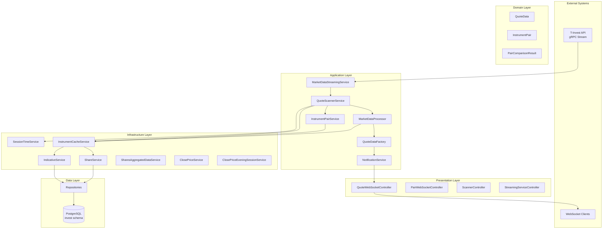
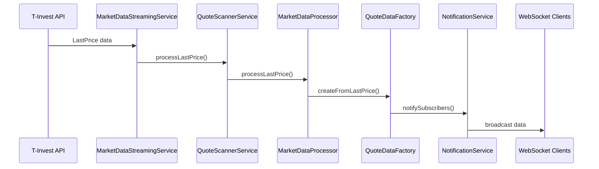
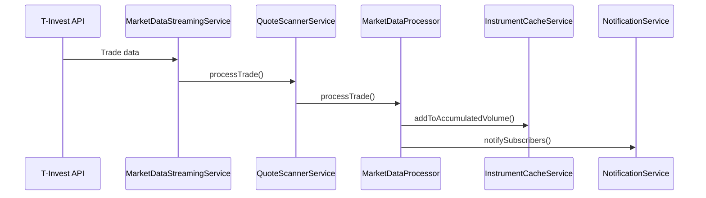
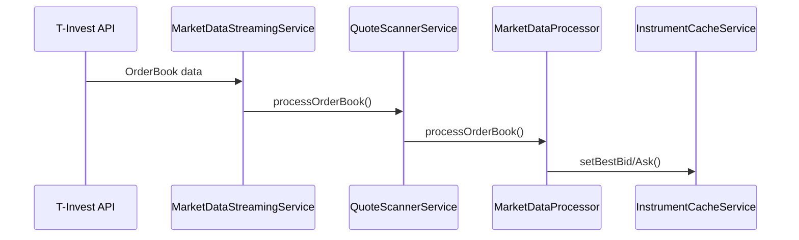

# Архитектура системы

## Обзор архитектуры

Investment Data Scanner Service построен на основе микросервисной архитектуры с использованием Spring Boot и следует принципам Domain-Driven Design (DDD) и Clean Architecture.

## Принципы архитектуры

### 1. Разделение ответственности (Separation of Concerns)

- Каждый компонент отвечает за конкретную область функциональности
- Четкое разделение между слоями приложения
- Минимальная связанность между компонентами

### 2. Асинхронная обработка

- Неблокирующая обработка данных
- Параллельная обработка уведомлений
- Асинхронные операции с базой данных

### 3. Высокая производительность

- Кэширование в памяти
- Оптимизированные пулы потоков
- Дедупликация данных

### 4. Отказоустойчивость

- Автоматическое переподключение
- Обработка ошибок
- Graceful degradation

## Слоистая архитектура

```
┌─────────────────────────────────────────────────────────────┐
│                    Presentation Layer                       │
│  ┌─────────────────┐  ┌─────────────────┐  ┌──────────────┐ │
│  │ REST Controllers│  │ WebSocket       │  │ Static       │ │
│  │                 │  │ Controllers     │  │ Resources    │ │
│  └─────────────────┘  └─────────────────┘  └──────────────┘ │
└─────────────────────────────────────────────────────────────┘
┌─────────────────────────────────────────────────────────────┐
│                    Application Layer                        │
│  ┌─────────────────┐  ┌─────────────────┐  ┌──────────────┐ │
│  │ QuoteScanner    │  │ MarketData      │  │ Notification │ │
│  │ Service         │  │ Processor       │  │ Service      │ │
│  └─────────────────┘  └─────────────────┘  └──────────────┘ │
└─────────────────────────────────────────────────────────────┘
┌─────────────────────────────────────────────────────────────┐
│                    Domain Layer                             │
│  ┌─────────────────┐  ┌─────────────────┐  ┌──────────────┐ │
│  │ Entities        │  │ Value Objects   │  │ Domain       │ │
│  │                 │  │                 │  │ Services     │ │
│  └─────────────────┘  └─────────────────┘  └──────────────┘ │
└─────────────────────────────────────────────────────────────┘
┌─────────────────────────────────────────────────────────────┐
│                    Infrastructure Layer                     │
│  ┌─────────────────┐  ┌─────────────────┐  ┌──────────────┐ │
│  │ Repositories    │  │ External APIs   │  │ Cache        │ │
│  │                 │  │                 │  │ Services     │ │
│  └─────────────────┘  └─────────────────┘  └──────────────┘ │
└─────────────────────────────────────────────────────────────┘
```

## Компонентная диаграмма



## Детальное описание компонентов

### 1. Presentation Layer

#### QuoteWebSocketController

- **Назначение**: Управление WebSocket соединениями для котировок
- **Ответственности**:
  - Установка и закрытие WebSocket соединений
  - Трансляция данных котировок клиентам
  - Управление подписками на обновления
- **Ключевые методы**:
  - `afterConnectionEstablished()` - обработка нового соединения
  - `broadcastQuote()` - трансляция данных клиентам
  - `cleanupInactiveSessions()` - очистка неактивных соединений

#### ScannerController

- **Назначение**: REST API для управления сканером
- **Ответственности**:
  - Предоставление статистики работы системы
  - Управление инструментами
  - Получение текущих цен
- **Ключевые endpoints**:
  - `GET /api/scanner/stats` - статистика
  - `GET /api/scanner/instruments` - список инструментов
  - `GET /api/scanner/prices` - текущие цены

### 2. Application Layer

#### QuoteScannerService

- **Назначение**: Центральный оркестратор системы
- **Ответственности**:
  - Координация между всеми компонентами
  - Управление жизненным циклом системы
  - Инициализация и загрузка данных
- **Ключевые методы**:
  - `init()` - инициализация системы
  - `processLastPrice()` - обработка цен
  - `processTrade()` - обработка сделок
  - `getStats()` - получение статистики

#### MarketDataStreamingService

- **Назначение**: Управление потоковым соединением с T-Invest API
- **Ответственности**:
  - Установка и поддержание gRPC соединения
  - Подписка на различные типы данных
  - Автоматическое переподключение
- **Ключевые методы**:
  - `startLastPriceStream()` - запуск потока данных
  - `processLastPrice()` - обработка цен
  - `processTrade()` - обработка сделок
  - `forceReconnect()` - принудительное переподключение

#### MarketDataProcessor

- **Назначение**: Высокопроизводительная обработка рыночных данных
- **Ответственности**:
  - Дедупликация входящих данных
  - Асинхронная обработка
  - Сбор метрик производительности
- **Ключевые методы**:
  - `processLastPrice()` - обработка цен
  - `processTrade()` - обработка сделок
  - `processOrderBook()` - обработка стакана
  - `shouldProcess()` - проверка необходимости обработки

#### NotificationService

- **Назначение**: Асинхронная доставка уведомлений
- **Ответственности**:
  - Управление подписчиками
  - Параллельная отправка уведомлений
  - Обработка ошибок доставки
- **Ключевые методы**:
  - `notifySubscribers()` - уведомление подписчиков
  - `subscribe()` - подписка на обновления
  - `unsubscribe()` - отписка от обновлений

### 3. Domain Layer

#### QuoteData

- **Назначение**: Основная сущность для передачи данных котировок
- **Свойства**:
  - `figi` - идентификатор инструмента
  - `currentPrice` - текущая цена
  - `priceChange` - изменение цены
  - `timestamp` - время получения данных
  - `volume` - объем сделки

#### InstrumentPair

- **Назначение**: Представление пары инструментов для анализа
- **Свойства**:
  - `firstInstrument` - первый инструмент
  - `secondInstrument` - второй инструмент
  - `currentDelta` - текущая дельта
  - `deltaPercent` - дельта в процентах

### 4. Infrastructure Layer

#### InstrumentCacheService

- **Назначение**: Кэширование данных об инструментах
- **Ответственности**:
  - Хранение цен, имен, тикеров
  - Быстрый доступ к данным
  - Управление жизненным циклом кэша
- **Ключевые методы**:
  - `getLastPrice()` - получение последней цены
  - `setLastPrice()` - установка цены
  - `getInstrumentName()` - получение имени инструмента
  - `clearCache()` - очистка кэша

#### SessionTimeService

- **Назначение**: Управление торговыми сессиями
- **Ответственности**:
  - Определение времени утренних сессий
  - Определение времени сессий выходного дня
  - Предоставление информации о текущей сессии
- **Ключевые методы**:
  - `isMorningSessionTime()` - проверка утренней сессии
  - `isWeekendSessionTime()` - проверка сессии выходного дня
  - `getCurrentSessionInfo()` - информация о текущей сессии

## Потоки данных

### 1. Обработка котировок



### 2. Обработка сделок



### 3. Обработка стакана заявок



## Конфигурация и настройка

### 1. Конфигурационные классы

#### AppConfig

- Управление переменными окружения
- Загрузка .env файлов
- Общие настройки приложения

#### PerformanceConfig

- Настройка пулов потоков
- Конфигурация асинхронной обработки
- Оптимизация производительности

#### MetricsConfig

- Настройка системы метрик
- Конфигурация мониторинга
- Настройка сбора статистики

### 2. Профили конфигурации

- `application.properties` - основная конфигурация
- `application-batch.properties` - настройки batch обработки
- `application-nonblocking.properties` - неблокирующая обработка
- `application-orderbook.properties` - настройки стакана заявок
- `application-streaming.properties` - потоковая обработка

## Производительность и масштабирование

### 1. Текущие ограничения

- **Пропускная способность**: 10,000 котировок/сек
- **Задержка**: < 10ms
- **Память**: ~500MB при 1000 инструментах
- **WebSocket соединения**: до 100 одновременных

### 2. Узкие места

1. **Обработка данных**: Дедупликация и валидация
2. **WebSocket трансляция**: Сериализация JSON
3. **Кэширование**: ConcurrentHashMap операции
4. **База данных**: Batch операции

### 3. Стратегии масштабирования

#### Горизонтальное масштабирование

- Разделение на микросервисы
- Load balancing
- Sharding данных

#### Вертикальное масштабирование

- Увеличение ресурсов сервера
- Оптимизация JVM
- Настройка пулов потоков

## Безопасность

### 1. Текущие меры

- Валидация входящих данных
- Обработка ошибок
- Логирование операций

### 2. Планируемые улучшения

- JWT аутентификация
- Rate limiting
- Шифрование данных
- Audit logging

## Мониторинг и наблюдаемость

### 1. Метрики

- **Бизнес-метрики**: Количество обработанных котировок
- **Технические метрики**: Время обработки, использование памяти
- **Пользовательские метрики**: Количество активных соединений

### 2. Логирование

- **Structured logging**: JSON формат
- **Log levels**: DEBUG, INFO, WARN, ERROR
- **Correlation IDs**: Отслеживание запросов

### 3. Health Checks

- **Liveness probe**: Проверка работы приложения
- **Readiness probe**: Готовность к обработке запросов
- **Custom health indicators**: Проверка внешних зависимостей

## Тестирование

### 1. Unit тесты

- Тестирование отдельных компонентов
- Mock внешних зависимостей
- Покрытие кода > 80%

### 2. Integration тесты

- Тестирование взаимодействия компонентов
- Тестирование с реальной базой данных
- End-to-end тестирование

### 3. Performance тесты

- Load testing
- Stress testing
- Memory profiling

## Развертывание

### 1. Контейнеризация

- Docker образы
- Multi-stage builds
- Оптимизация размера

### 2. Оркестрация

- Kubernetes манифесты
- Helm charts
- Service mesh (Istio)

### 3. CI/CD

- Автоматическая сборка
- Автоматическое тестирование
- Автоматическое развертывание

## Эволюция архитектуры

### 1. Текущее состояние

- Монолитное Spring Boot приложение
- Синхронная обработка данных
- Простое кэширование

### 2. Планируемые улучшения

- Event-driven architecture
- Микросервисная архитектура
- CQRS и Event Sourcing
- Reactive programming

### 3. Долгосрочные цели

- Cloud-native архитектура
- Serverless компоненты
- AI/ML интеграция
- Real-time analytics

## Заключение

Текущая архитектура обеспечивает хорошую производительность и поддерживаемость для текущих требований. Предложенные улучшения позволят системе масштабироваться и адаптироваться к растущим нагрузкам и новым требованиям.

Ключевые принципы архитектуры:

- **Простота**: Легко понимать и поддерживать
- **Производительность**: Высокая пропускная способность
- **Надежность**: Отказоустойчивость и восстановление
- **Масштабируемость**: Возможность роста
- **Тестируемость**: Легко тестировать и отлаживать
