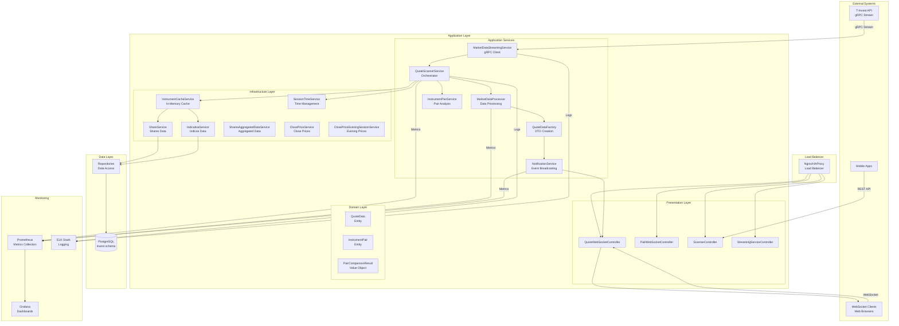
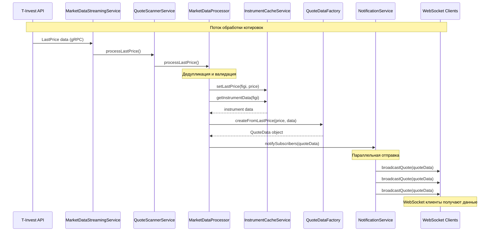
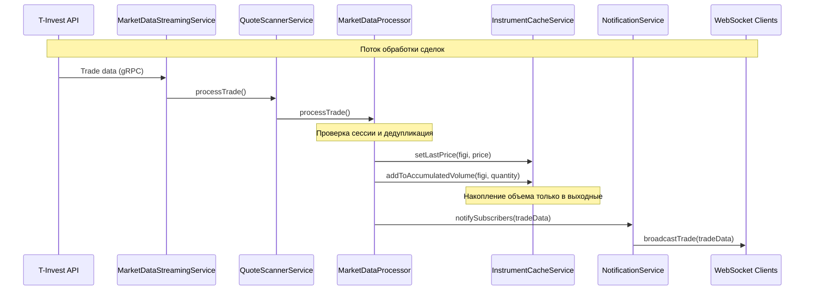
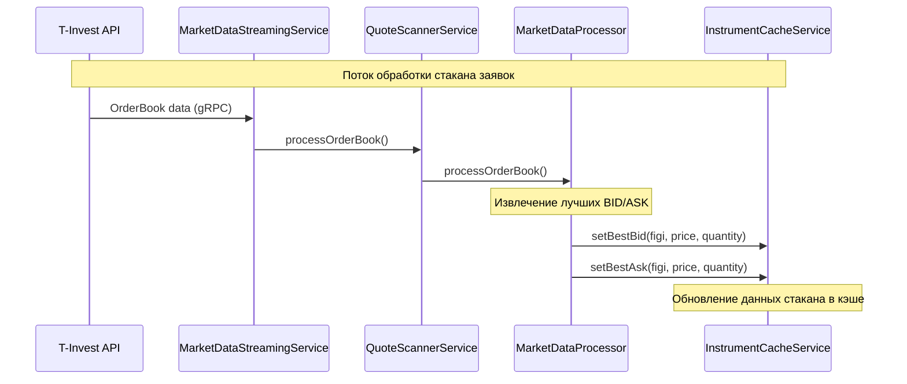
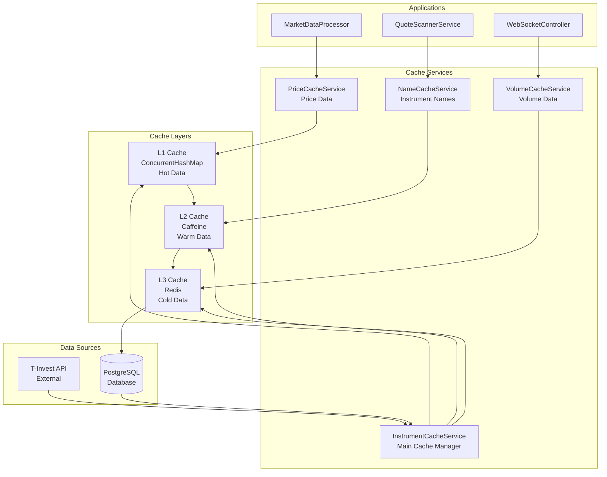
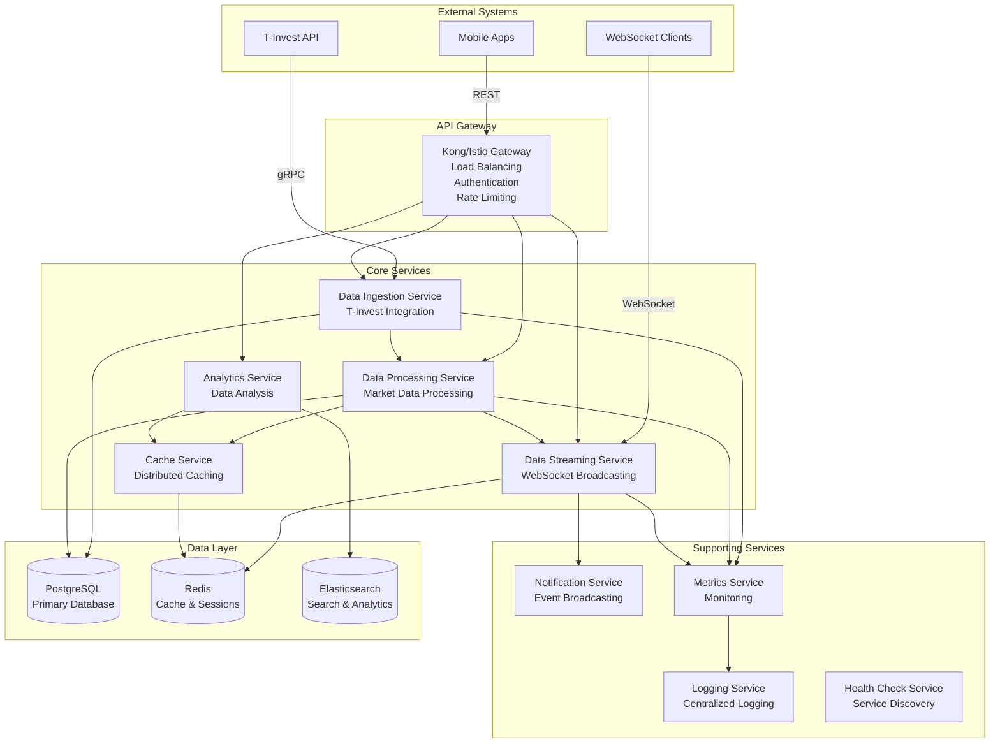
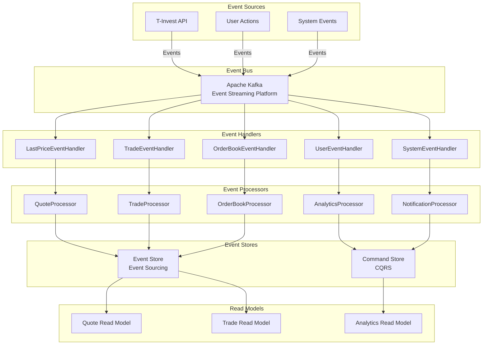
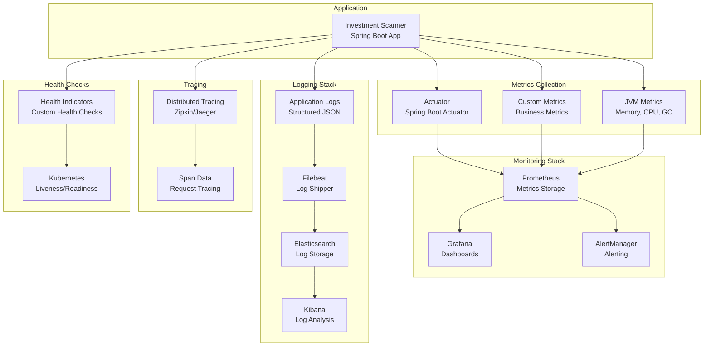
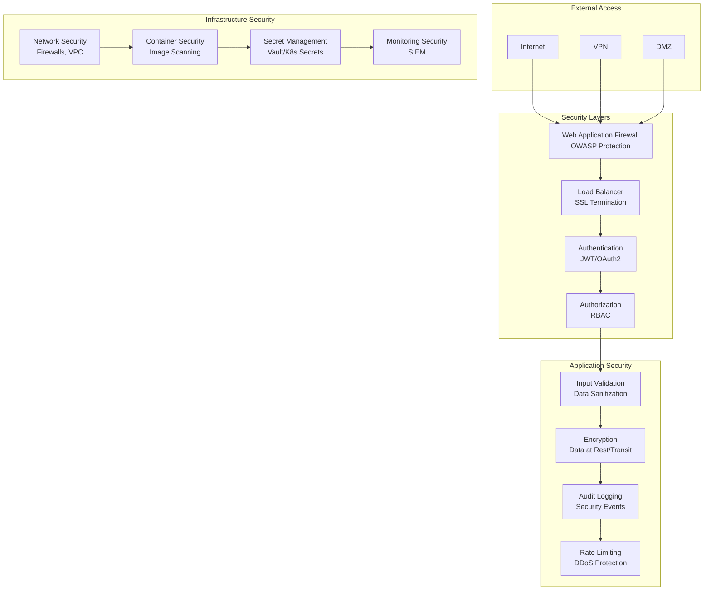

# Архитектурные диаграммы

## Общая архитектура системы

## Поток обработки данных

## Поток обработки сделок

## Поток обработки стакана заявок

## Архитектура кэширования

## Микросервисная архитектура (будущее)

## Event-driven архитектура (будущее)

## Мониторинг и наблюдаемость

## Безопасность

## Заключение

Эти диаграммы показывают:

1. **Текущую архитектуру** - монолитное Spring Boot приложение с четким разделением слоев
2. **Потоки данных** - как данные проходят через систему от T-Invest API до клиентов
3. **Кэширование** - многоуровневая система кэширования для оптимизации производительности
4. **Будущую архитектуру** - микросервисы и event-driven подход
5. **Мониторинг** - полная система наблюдаемости
6. **Безопасность** - многоуровневая защита системы

Диаграммы помогают понять:

- Как компоненты взаимодействуют друг с другом
- Где находятся узкие места
- Как система может масштабироваться
- Какие улучшения необходимы
